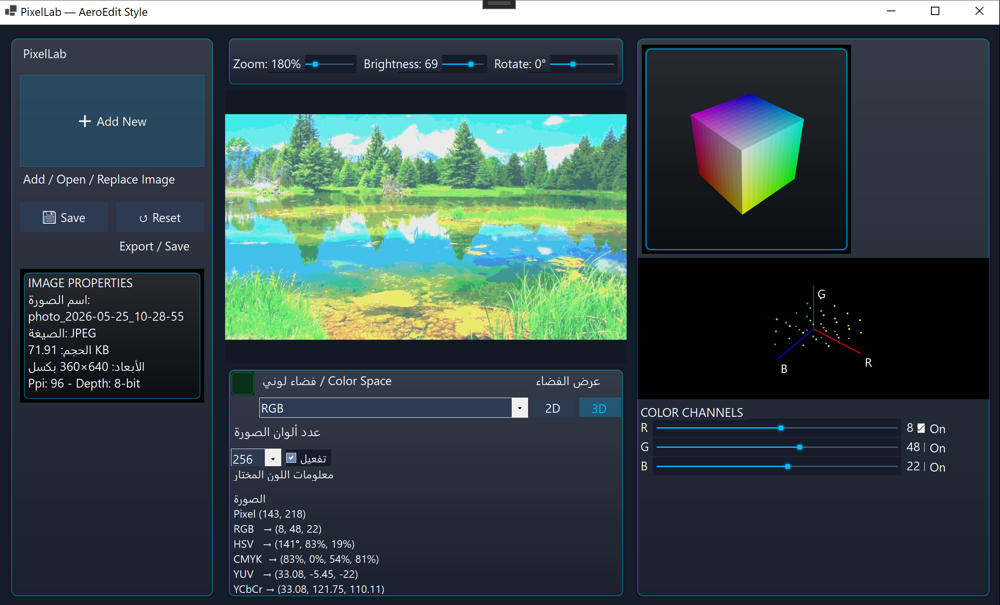
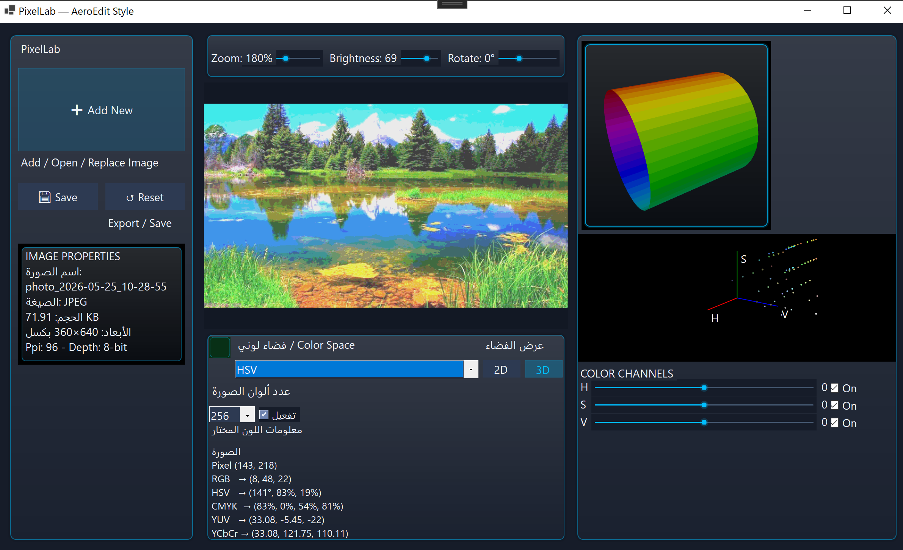

# PixelLab

<p align="center">
  
  
  
</p>

<p align="center">
  <strong>AI-Style Color Lab | Image Processing & Color Space Explorer | Interactive 2D/3D Visualization</strong>
</p>

<p align="center">
  <em>PixelLab is a modern Windows desktop application for image editing, color analysis, and 3D color-space exploration.</em>
</p>

---

## Overview

PixelLab is a Windows desktop image lab built with <strong>WinForms</strong> and <strong>WPF</strong> on <strong>.NET 8</strong>. It focuses on practical image manipulation and visual color-space inspection in a polished Aero-style interface.

The application combines image preview, pixel inspection, color conversion, adjustable filters, and interactive 3D visualization to help users study how colors behave across different spaces.

## Key Features

- Load, add, replace, and preview images.
- Inspect pixel color values directly from the canvas.
- Convert between multiple color spaces: RGB, HSV, CMYK, YUV, LAB, and YCbCr.
- Adjust brightness, zoom, and rotation interactively.
- Switch between 2D and 3D color-space views.
- Visualize RGB and HSV spaces using a dedicated 3D control powered by HelixToolkit.
- Track channel values with live sliders and on/off toggles.
- Export and save edited results from the interface.

## Screenshots

### RGB Mode



### HSV Mode



## Tech Stack

- C#
- .NET 8 Windows Forms
- WPF integration
- Emgu CV
- HelixToolkit.Wpf
- Microsoft.Windows.Compatibility

## Project Structure

- `PixelLab/Form1.cs` - main editor window and image workflow.
- `PixelLab/Controls/ColorSpace3DControl.xaml.cs` - 3D color-space visualization.
- `PixelLab/UiTheme.cs` - theme helpers and UI styling.
- `PixelLab/ModernTrackBar.cs` - custom slider control.
- `PixelLab/GlassPanel.cs` - styled panel component.

## Getting Started

### Prerequisites

- Windows 10 or later
- .NET 8 SDK

### Build and Run

```bash
git clone https://github.com/E-S-Waga15/PixelLab.git
cd PixelLab
dotnet restore
dotnet build
dotnet run --project PixelLab/PixelLab.csproj
```

## What Makes PixelLab Different

PixelLab is not only a basic image editor. It is designed as a visual learning tool for color theory and image processing. The interface lets you see how a single image behaves in multiple color spaces, while the 3D cube/cylinder views make color relationships easier to understand.

## License

This project currently does not define a license. Add one if you plan to share or distribute the repository publicly.